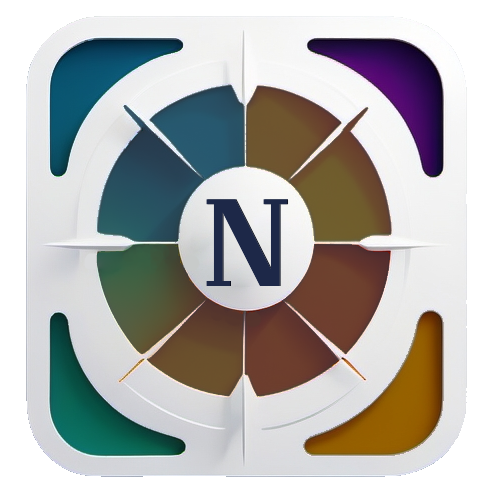
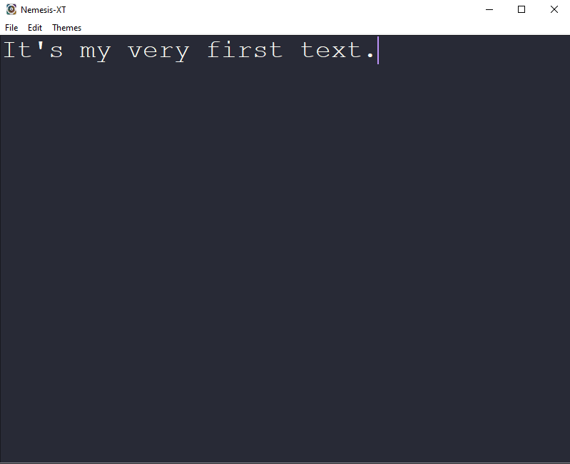

# Nemesis XT 

---
# Contents

- [Introduction](#introduction)
- [Features](#features)
- [Themes](#themes)
- [Screenshots](#screenshots)
- [Installation](#installation)
- [License](#license)
- [Contact](#contact)

---

---
# Introduction

Nemesis XT is a modern, responsive, and customizable theme for any purpose. 

It is designed to be lightweight and fast, making it suitable for both personal and professional use. 

It is designed for anyone who values a versatile and efficient text editing experience. 

---
# Features

Personalized settings, including custom colors, fonts, and layouts.

---
# Themes

Nemesis XT comes with a variety of themes to suit your preferences:
- **Classic**: A timeless design with a clean and simple white-black layout.
- **Black and White**: A retro-terminal style with a black background and white text.
- **Atom**: A modern, sleek design with a dark background and vibrant accents.
- **Sublime Text**: A minimalist theme with a focus on readability and simplicity.

---
# Screenshots

### Atom Theme:

---
# Installation

To install Nemesis XT, follow these steps:
- Navigate to the `Nemesis XT` directory.
- Click on "Releases" in the top right corner.
- Click on the latest release (most top).
- Scroll down to the "Assets" section.
- Click on `Nemesis XT.zip` to download the file.

---
# License
Nemesis XT is released under a Source Available License.

- ✅ Free to use personally and internally
- ❌ No modifications or forks allowed
- ❌ No redistribution or commercial offerings allowed

See the LICENSE file for full terms.

---
# Contact

For any questions or feedback, please contact:
- [**GitHub**](https://github.com/a-jean-andreasian)
- [**LinkedIn**](https://www.linkedin.com/in/armen-jean-andreasian/)

---